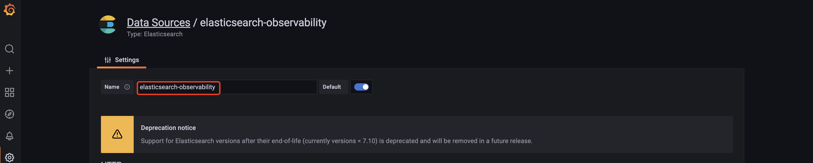
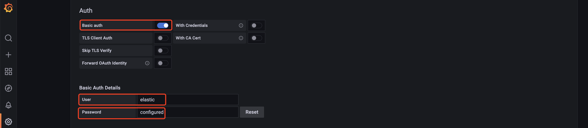
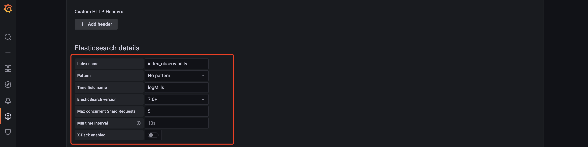

# 环境准备

Grafana 8.5.9+.

**注：如选择高版本 Grafana（如：Grafana 9+），对 Elasticsearch 版本也有要求（Grafana 9 最小支持 Elasticsearch 8+），需要根据实际使用的 Elasticsearch 版本选择对应 Grafana 版本。**

# Grafana 安装

1. Linux 下执行`yum -y install grafana-enterprise-8.5.9-1.x86_64.rpm`
2. Linux 下执行`systemctl start grafana-server`

# 数据源配置

在Grafana菜单栏中选择 `Configuration` -> `Data Sources`，点击 `Add data source` 按钮，配置 Elasticsearch 类数据源，如下：

1. 配置数据源名称为`elasticsearch-observability`，如下图：

   

2. 在 HTTP Tab，配置 Elasticsearch 连接信息，如下图：

   

3. 在 Auth Tab，配置 Elasticsearch 认证信息（如有配置），如下图：

   

4. 配置 Elasticsearch details 信息，如下图：

   

# 导入模板

在菜单栏点击`import`链接，导入kf-observability工程中[grafana/template](../grafana/template/)下的模板文件，即可使用。